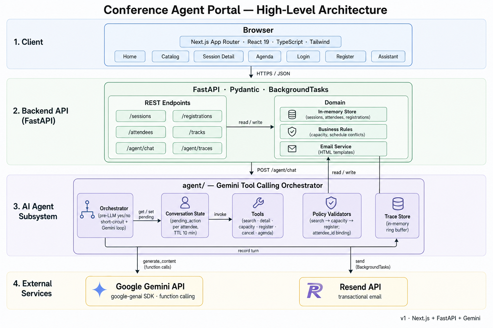

# Conference Agent Portal

A full-stack attendee portal for a fictional enterprise tech conference (**Atlas
Conference 2026**), inspired by — but not copied from — events such as Stripe
Sessions, AWS re:Invent, RSAC, and Google Cloud Next.

A working portal backed by an in-memory mock catalog of 50 realistic
sessions across 10 tracks, with mock auth, transactional email (Resend),
and a Gemini-powered AI assistant that uses real tool calling to search,
register, cancel, and view the user's agenda.

```
conference-agent-portal/
├── backend/        FastAPI + Pydantic API (Python 3.11+)
├── frontend/       Next.js App Router + TypeScript + Tailwind CSS
├── docs/           Architecture diagram & supporting assets
└── README.md
```

---

## Architecture



High-level layering (matches the diagram):

```
┌────────────────────────── Browser ──────────────────────────┐
│  Next.js App Router · React 19 · TypeScript · Tailwind      │
│  Pages: home · catalog · session detail · agenda            │
│         login · register · assistant                        │
└──────────────────────────────┬──────────────────────────────┘
                               │ HTTP (NEXT_PUBLIC_API_BASE_URL)
┌──────────────────────────────▼──────────────────────────────┐
│  FastAPI app (backend/app/main.py) · CORS · BackgroundTasks │
│                                                             │
│  ┌── app/ ──────────────────┐  ┌── agent/ ───────────────┐  │
│  │ models.py  Pydantic      │  │ orchestrator.py         │  │
│  │ store.py   In-memory     │  │   pre-LLM short-circuit │  │
│  │            biz rules     │  │   + Gemini tool loop    │  │
│  │ email.py   Resend tmpl   │  │ conversation.py         │  │
│  │ data/      50 sessions   │  │   pending_action / TTL  │  │
│  └──────────────────────────┘  │ gemini_client.py        │  │
│                                │   tool declarations     │  │
│                                │ tools.py  6 LLM tools   │  │
│                                │ validators.py PolicyState│  │
│                                │ traces.py ring-buffer   │  │
│                                │ schemas.py              │  │
│                                └──────────┬──────────────┘  │
└────────────┬───────────────────────────────┼────────────────┘
             │                               │
             ▼                               ▼
       Resend API                     Google Gemini API
       (transactional email)          (google-genai SDK)
```

Key request flows:

- **REST** (`/sessions/*`, `/registrations`, `/attendees/*`) → `app/store.py`
  enforces capacity + schedule-conflict rules in memory; mutations may
  fire a background email via `app/email.py`.
- **Agent** (`POST /agent/chat`) → `agent/orchestrator.run_chat`
  - If the user message is a bare `yes` / `no`, a deterministic
    short-circuit runs `check_capacity` → `register_session` (or clears
    the `pending_action`) **without calling Gemini** — saves quota and
    keeps the "Would you like to register?" flow reliable.
  - Otherwise, Gemini chooses tool calls via function calling; the
    orchestrator executes each one through `agent/tools.py`, gated by
    `agent/validators.py` (search → capacity → register, attendee_id
    binding, no inventing `REG-` IDs). The whole turn is recorded in
    `agent/traces.py` and exposed via `GET /agent/traces`.

---

## Highlights

- **50 fictional sessions** across 10 tracks (Payments & Fintech, Stablecoins
  & Global Money Movement, AI Agents & Automation, AI Safety & Agent
  Evaluation, Cybersecurity & Identity, Cloud Infrastructure, Data Engineering
  & Analytics, Developer Platforms, Product Leadership, Compliance & Risk).
- **Search & filter** by topic, track, date, time of day, and skill level.
- **Capacity status** badges: Available, Almost Full, Full, with live progress
  bars on every card and detail page.
- **Real registration logic** that enforces:
  1. Cannot register for a full session.
  2. Cannot register for overlapping sessions on the same day.
  3. Returns a `registration_id` and updates capacity atomically.
  4. Clear, human-readable error messages.
- **Personal agenda view** for the signed-in attendee with per-day timeline
  grouping and one-click cancel.
- **Mock auth** (no passwords): create an account or sign in by email; the
  current user is persisted in `localStorage`. A seeded demo account
  (`alex.demo@atlasconf.example`, ID `attendee_001`) is always available.
- **Transactional email via Resend** (optional): welcome email on signup,
  confirmation email on session registration, cancellation email on
  un-registration. Falls back to logging when no API key is configured, so
  the app still runs offline.
- **AI assistant via Gemini tool calling** (optional): natural-language
  chat that searches sessions, checks capacity, registers, cancels, and
  views the agenda by chaining real API calls. Server-side policy
  enforces "search → check capacity → register" and other invariants
  even if the model tries to skip steps.
- **Modern, enterprise-style UI** built with Tailwind, designed to feel like
  a Cvent/Sessionize-class attendee experience.

---

## Prerequisites

- **Python** 3.11 or newer (tested on 3.13)
- **Node.js** 18.18+ (tested on Node 20+)
- **npm** 9+

---

## 1. Backend — FastAPI

```bash
cd backend
python3 -m venv .venv
source .venv/bin/activate
pip install -r requirements.txt

# Optional: configure email sending via Resend (see "Email" section below)
cp .env.example .env

uvicorn app.main:app --reload --port 8000
```

The API now serves:

- Health check: <http://localhost:8000/health>
- Interactive docs (Swagger UI): <http://localhost:8000/docs>
- ReDoc: <http://localhost:8000/redoc>

> The store lives **in process memory only**. Restarting the server resets
> all registrations and capacity counts.

### API endpoints

| Method | Path                                  | Description                                    |
| ------ | ------------------------------------- | ---------------------------------------------- |
| GET    | `/health`                             | Health check                                   |
| GET    | `/sessions/search`                    | List/filter sessions (see query params below)  |
| GET    | `/sessions/{session_id}`              | Get a single session                           |
| GET    | `/sessions/{session_id}/capacity`     | Capacity + status for a session                |
| POST   | `/registrations`                      | Register an attendee for a session             |
| DELETE | `/registrations/{registration_id}`    | Cancel a registration                          |
| GET    | `/attendees`                          | List all attendees                             |
| POST   | `/attendees`                          | Create a new attendee account                  |
| POST   | `/attendees/login`                    | Sign in by email (returns the attendee record) |
| GET    | `/attendees/{attendee_id}`            | Get an attendee profile                        |
| GET    | `/attendees/{attendee_id}/agenda`     | Get an attendee's full registered agenda       |
| POST   | `/agent/chat`                         | Chat with the Gemini-powered assistant         |
| GET    | `/agent/traces`                       | List recent assistant traces                   |
| GET    | `/agent/traces/{trace_id}`            | Get a single full assistant trace              |
| GET    | `/tracks`                             | List all tracks (helper for the UI)            |
| GET    | `/dates`                              | List all conference dates (helper for the UI)  |

#### `GET /sessions/search` query params

- `topic` — substring match on `topic`
- `date` — ISO date, e.g. `2026-06-09`
- `time_of_day` — `morning` \| `afternoon` \| `evening`
- `level` — `beginner` \| `intermediate` \| `advanced`
- `track` — substring match on track name
- `q` — free-text search across title, description, speaker, company, track,
  topic

#### Example

```bash
curl -s 'http://localhost:8000/sessions/search?track=AI+Agents&level=advanced'

curl -s -X POST http://localhost:8000/registrations \
  -H 'content-type: application/json' \
  -d '{"attendee_id":"attendee_001","session_id":"S011"}'
```

#### Error contract

Error responses use HTTP status codes and a structured body:

```json
{
  "detail": {
    "error": "schedule_conflict",
    "message": "This session overlaps with 'Building Payment Flows for Global Marketplaces' (2026-06-09 09:00–10:00). Cancel that registration first if you'd like to switch."
  }
}
```

| Code | `error`             | When                                                       |
| ---- | ------------------- | ---------------------------------------------------------- |
| 400  | `invalid_input`     | Bad input, e.g. malformed email when registering           |
| 404  | `not_found`         | Session, registration, or attendee ID does not exist       |
| 409  | `email_taken`       | An account with that email already exists                  |
| 409  | `session_full`      | Session has no capacity remaining                          |
| 409  | `schedule_conflict` | Attendee already has an overlapping or duplicate booking   |

---

## 2. Frontend — Next.js (App Router)

```bash
cd frontend
npm install

# Optional: configure the backend URL (defaults to http://localhost:8000)
cp .env.local.example .env.local

npm run dev
```

Open <http://localhost:3000>.

The frontend assumes the backend is reachable at the value of
`NEXT_PUBLIC_API_BASE_URL` (default `http://localhost:8000`). The default
attendee ID used everywhere is `NEXT_PUBLIC_DEFAULT_ATTENDEE_ID` (default
`attendee_001`).

### Pages

- `/` — Landing page with featured sessions and track tiles
- `/sessions` — Full catalog with all filters and date grouping
- `/sessions/[sessionId]` — Detail page with capacity, speaker info,
  registration / cancellation
- `/agenda` — Personal agenda for the signed-in user, grouped by day, with
  one-click cancel
- `/login` — Sign in by email (no password — demo mode)
- `/register` — Create a new attendee account (email, name, optional
  company / role)

### Authentication (mock)

The portal uses a **localStorage-based mock auth** intended only for demos:

1. Click **Create account** in the header (top-right) and submit your email,
   name, and optional company/role.
2. You are immediately signed in; the header shows your name and a user menu
   with **Sign out**.
3. Returning visitors can use **Sign in** with the same email.
4. The seeded account `alex.demo@atlasconf.example` (ID `attendee_001`) is
   always available for quick demos.

This is **not** real authentication: there are no passwords, sessions, or
tokens, and the backend does not enforce identity beyond requiring the
`attendee_id` to exist. Multiple users can use the same browser by signing
out and signing back in as someone else.

---

## Email (optional, via Resend)

The backend can send transactional emails through **[Resend](https://resend.com)**:

| Trigger                      | Email                                                   |
| ---------------------------- | ------------------------------------------------------- |
| `POST /attendees`            | Welcome email                                           |
| `POST /registrations`        | Registration confirmation (with session details + ID)   |
| `DELETE /registrations/{id}` | Cancellation notice                                     |

Emails are sent **after** the API response is returned (FastAPI
`BackgroundTasks`), so a slow/failed email never blocks or fails the
request. If Resend is unavailable, the failure is logged and ignored.

### Setup

1. Get an API key at <https://resend.com/api-keys>.
2. Copy the example file and fill in your key:

   ```bash
   cd backend
   cp .env.example .env
   ```

3. Edit `backend/.env`:

   ```env
   RESEND_API_KEY=re_your_key_here
   RESEND_FROM=Atlas Conference <onboarding@resend.dev>
   APP_BASE_URL=http://localhost:3000
   ```

4. Restart the backend.

### About the `From` address

- **`onboarding@resend.dev`** — works without verifying a domain, but
  Resend will only deliver to the email address registered on your Resend
  account. Great for "send to yourself" demos.
- **Your own domain** — verify it under Resend → Domains, then use any
  address on that domain (e.g. `noreply@yourdomain.com`). Required to
  send to arbitrary recipients.

### Skipping email entirely

Leave `RESEND_API_KEY` blank (or unset). The backend logs each would-be
email to stdout instead, e.g.:

```
INFO:     [email] [email-stub] to=jane@acme.com subject='Welcome to Atlas Conference 2026' (set RESEND_API_KEY to send)
```

This makes the app fully usable offline, in CI, or before you've signed
up for Resend.

---

## AI Assistant (optional, via Gemini)

A natural-language assistant lives at `/assistant` in the UI and at
`POST /agent/chat` in the API. It uses **Google's Gemini 2.5 Flash with
real function calling** to chain actual API calls — no keyword matching.

### Available tools (LLM-callable)

| Tool                 | Backed by                                  |
| -------------------- | ------------------------------------------ |
| `search_sessions`    | `GET /sessions/search`                     |
| `get_session_detail` | `GET /sessions/{id}`                       |
| `check_capacity`     | `GET /sessions/{id}/capacity`              |
| `register_session`   | `POST /registrations`                      |
| `cancel_registration`| `DELETE /registrations/{id}`               |
| `get_agenda`         | `GET /attendees/{id}/agenda`               |

### Server-side policy (enforced even if the model tries to skip)

1. To register from a topic/title/date phrase, the orchestrator requires
   the order **`search_sessions` → `check_capacity` → `register_session`**.
2. `register_session` is rejected unless:
   - the `session_id` was returned by an earlier search/detail/agenda call, AND
   - `check_capacity` was called for that exact `session_id`, AND
   - that capacity result was not `full`.
3. If a search returns multiple matches and the user hasn't picked one,
   the model presents candidates and asks — never auto-registers.
4. `cancel_registration` is rejected unless the `registration_id` was
   produced by `get_agenda` or a successful `register_session` in the
   same conversation. The model can never invent a `REG-…` ID.
5. The orchestrator silently overrides any `attendee_id` argument with
   the request's authenticated `attendee_id`, so the model can never act
   on behalf of someone else.

Blocked tool calls return a structured `policy_violation` to the model so
it can recover gracefully (e.g. "you must check capacity first"), and the
violation is also surfaced in the response for transparency.

### Setup

1. Get a Gemini API key at <https://aistudio.google.com/apikey>.
2. Add to `backend/.env`:

   ```env
   GEMINI_API_KEY=your_key_here
   ```

3. Restart the backend.

### Request / response

```bash
curl -s -X POST http://localhost:8000/agent/chat \
  -H 'content-type: application/json' \
  -d '{"attendee_id":"attendee_001","message":"Register me for session S017"}'
```

```json
{
  "trace_id": "trace_c22dbfc21e98",
  "user_message": "Register me for session S017",
  "tool_calls": [
    { "step_number": 1, "tool_name": "check_capacity", ... , "success": true },
    { "step_number": 2, "tool_name": "register_session", ... , "success": true }
  ],
  "final_answer": "You are now registered for session S017. Your registration ID is REG-3028FC7919.",
  "status": "completed",
  "policy_violations": []
}
```

`status` is one of `completed | clarification_needed | failed`.

### Rate limits & no-key fallback

- The free Gemini tier allows ~5 requests/minute on `gemini-2.5-flash`.
  The orchestrator catches `429` responses and returns a friendly
  "rate limit reached" message instead of a 500.
- If `GEMINI_API_KEY` is missing, `/agent/chat` returns a `failed`
  response with a clear "GEMINI_API_KEY not set" message — no crash.

### Production build

```bash
cd frontend
npm run build
npm start
```

---

## 3. Running both at once

In two terminals:

```bash
# Terminal 1
cd backend && source .venv/bin/activate && uvicorn app.main:app --reload --port 8000

# Terminal 2
cd frontend && npm run dev
```

Then visit <http://localhost:3000>.

---

## Project structure

```
backend/
├── app/
│   ├── __init__.py
│   ├── main.py             FastAPI app & route handlers
│   ├── models.py           Pydantic models (Session, Registration, …)
│   ├── store.py            In-memory store + business rules
│   ├── email.py            Resend integration + HTML templates
│   └── data/
│       └── sessions.py     50 fictional conference sessions
├── agent/                  Gemini-powered AI assistant
│   ├── gemini_client.py    Client + function declarations + system prompt
│   ├── tools.py            6 LLM-callable tools wrapping the store
│   ├── validators.py       Policy state machine + per-call validators
│   ├── orchestrator.py     run_chat() loop with pre-LLM yes/no short-circuit
│   ├── conversation.py     Per-attendee pending_action store (TTL 10 min)
│   ├── traces.py           In-memory ring-buffer of conversation traces
│   └── schemas.py          Pydantic models for chat/trace/violations
├── requirements.txt
├── .env.example            Copy to .env and fill in RESEND_API_KEY/GEMINI_API_KEY
└── .venv/                  (created by you, ignored)

docs/
└── architecture.png        High-level architecture diagram (shown above)

frontend/
├── package.json
├── tsconfig.json
├── next.config.mjs
├── tailwind.config.ts
├── postcss.config.mjs
├── .env.local.example
└── src/
    ├── app/
    │   ├── layout.tsx                     Wraps app in <AuthProvider>
    │   ├── globals.css
    │   ├── page.tsx                       Home
    │   ├── sessions/
    │   │   ├── page.tsx                   Catalog
    │   │   └── [sessionId]/
    │   │       ├── page.tsx               Detail
    │   │       └── not-found.tsx
    │   ├── agenda/
    │   │   └── page.tsx                   My agenda (signed-in only)
    │   ├── assistant/
    │   │   └── page.tsx                   AI assistant chat + trace panel
    │   ├── login/
    │   │   ├── page.tsx
    │   │   └── login-form.tsx
    │   └── register/
    │       ├── page.tsx
    │       └── register-form.tsx
    ├── components/
    │   ├── SiteHeader.tsx                 Includes user menu / sign-out
    │   ├── SiteFooter.tsx
    │   ├── SessionCard.tsx
    │   ├── SessionFilters.tsx
    │   ├── RegisterButton.tsx             Auth-aware
    │   └── CancelRegistrationButton.tsx
    └── lib/
        ├── api.ts          Typed API client (incl. attendee endpoints)
        ├── auth.tsx        AuthProvider + useAuth() hook
        ├── format.ts       Date/time/capacity helpers
        └── types.ts        Shared TS types
```

---

## Disclaimer

All session titles, descriptions, speakers, companies, and the conference
itself are **fictional** and were created for demo purposes. Any resemblance
to real talks, people, or events is intentional only at the level of common
industry topics.
